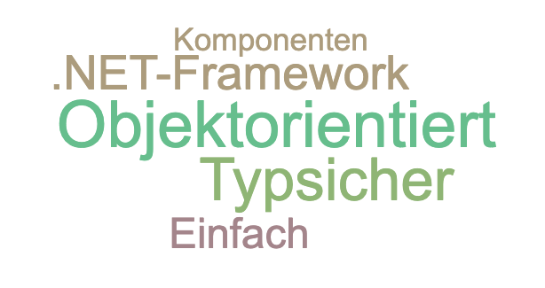

# 📖 C\# Grundlagen

## 💬 Klassendiskussion

* Welche Sprachen kennt ihr?
* Wie unterscheiden sie sich?
  * Syntax
  * Kompiliert vs. Interpretiert _-&gt; Was bedeutet das?_
  * Objektorientiert vs. Prozedural _-&gt; Was ist der Unterschied?_
* Welches ist "die beste" Sprache?


## Sprachverwandtschaften

Viele Sprachen haben sehr ähnliche Syntax. Nachfolgend stehen einige Konstrukte von C/C++, Java, VB und C\# im Vergleich.





























## Eigenschaften von C\#



### 💬 Typsicherheit

```csharp
// Beispiel 1
int intNumber = 12000;
long longNumber = intNumber;
```

```csharp
// Beispiel 2
long longNumber = 12000;
int intNumber = longNumber;
```

Funktionieren die beiden Beispiele?  
Warum? Warum nicht?


## Einsatzbereich

C\# ist sehr vielseitig einsetzbar. Früher war es eher auf Desktopanwendungen für die Windowsplattform fokussiert, heute ist es mit .NET Core universell einsetzbar.

### Desktop

Mit WinForms, WPF oder Konsolenanwendungen können mit C\# und dem .NET Framework seit eh und je Desktopanwendungen entwickelt werden. Sie sind noch immer weit verbreitet.

Mit Frameworks wie [Mono](https://www.mono-project.com/) und [Avalonia](https://avaloniaui.net/) können auch Desktop Apps für Linux und macOS in C\# entwickelt werden.

### Web

Seit Microsoft .NET Core lanciert hat, welches neben Windows auch unter Linux und macOS läuft, eignet sich C\# noch mehr für die Programmierung von Web-Backends und REST APIs.

### Mobile

Mit [Xamarin](https://dotnet.microsoft.com/apps/xamarin) können mobile Apps für Android und iOS in C\# entwickelt werden. Früher kostete eine  Lizenz etwa CHF 1500.- pro Entwickler pro Jahr. Das war vielen kleineren Herstellern zu viel. Seit Microsoft Xamarin 2016 aufgekauft hat, steht es den Entwicklern kostenlos zur Verfügung und wird von Microsoft selbst weiterentwickelt. Damit entwickelt man sogenannte Cross-Platform Native Apps. Die Apps werden zu plattformspezifischem Maschinencode kompiliert und laufen auf den Plattformen dann wie native Apps.

### IoT & Embedded

Da .NET Core sogar auf ARM Prozessoren läuft, kann es auch für die Entwicklung auf kleinen Prozessoren wie dem Raspberry Pi verwendet werden. Dies ermöglicht die Realisation vieler IoT Anwendungen mit C\#.


## 📖 C\# Syntax

Lies das folgende Dokument \(ab Kapitel 2.\) durch, um deine Kenntnisse mit der C\# Syntax aufzufrischen.



### Ergänzung: String Interpolation

```csharp
var i = 5;
var s = $"Die Zahl ist {i}.";
```

